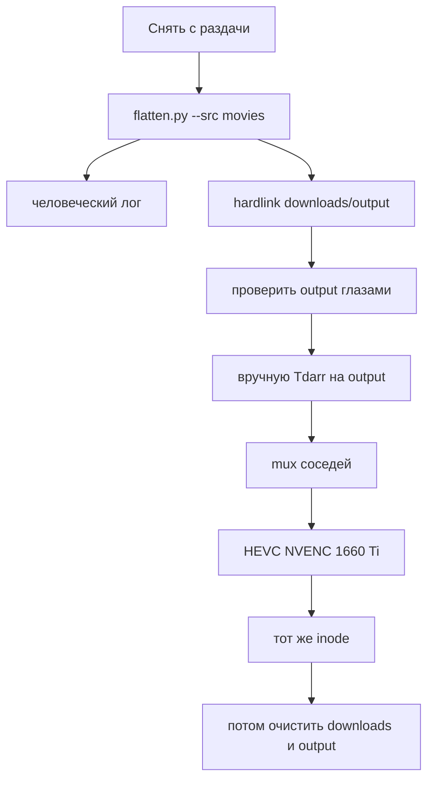
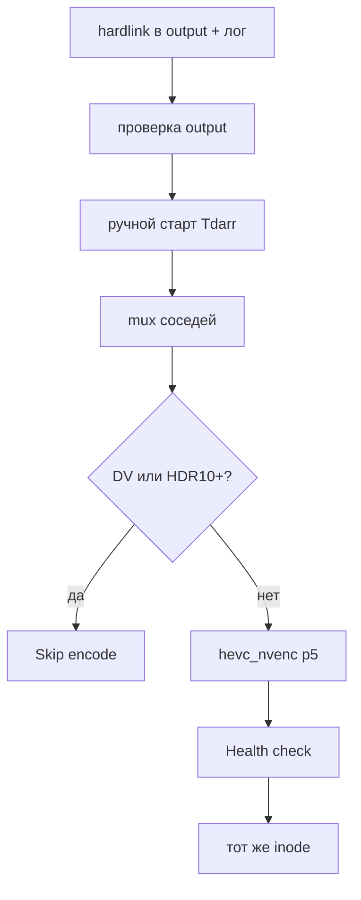

# План настройки Tdarr: HEVC + mux озвучек для аниме

Tdarr на Ubuntu рядом с ARR. Сейчас **GTX 1660 Ti**. Профиль **3070 Ti** — в [конце](#10-на-будущее-rtx-3070-ti), не включать.

## Исходные допущения

- Скрипт на одну папку (`downloads/movies`, потом `tv`, `anime`). Только **hardlink** в `../output`. Аппрув не нужен: раздачу не меняет, `output` можно снести. Пишет **человеческий лог**.
- Tdarr смотрит **только на output**. Запуск **вручную**, когда output проверен. Расписание не настраиваем.
- Снять с раздачи до HEVC (скрипт безопасен, encode меняет inode исходника).
- После приёмки вручную очистить `downloads` и `output`; в Jellyfin останутся MKV.
- DV/HDR10+ skip. Контейнер MKV, `a/s copy`, ASS не в SRT.
- Новые дорожки — русский, кроме явного `[ENG]`. Матч: то же имя, иначе номер в названии.
- HEVC — запись в **тот же inode**, не `mv`.

## Архитектура



**Принцип:** скрипт собирает чистое дерево, Tdarr работает только с `output`, старт руками.

## Быстрый старт

```bash
# 1. Проверить хост и GPU
./scripts/check-host-gpu.sh
./scripts/test-nvenc.sh

# 2. Подготовить output (пример: movies)
python3 ./scripts/flatten.py \
  --src /mnt/media/downloads/movies \
  --dst /mnt/media/downloads/output/movies \
  --log flatten.log

# 3. Прочитать лог, проверить дерево output

# 4. Поднять Tdarr
cp .env.example .env   # поправить пути
docker compose up -d

# 5. В UI: Scan /media/output, 1 GPU worker, без scheduler/folder watch
```

---

## 1. Хост и GPU — сейчас GTX 1660 Ti

- Проприетарный драйвер, `nvidia-smi` видит 1660 Ti, 6 ГБ.
- NVIDIA Container Toolkit, `nvidia-ctk runtime configure --runtime=docker`, рестарт Docker.
- Тест NVENC:

```bash
./scripts/test-nvenc.sh
```

### Лимиты 1660 Ti

Turing, 1× NVENC: HEVC 4K и Main10 есть, B-frames есть. **1 GPU-воркер** (4K и 1080). Второй воркер на 1080 — только если карта не в throttling и NAS тянет.

Днём, если Jellyfin тоже берёт NVENC — Tdarr не запускать (и так вручную).

6 ГБ VRAM: для 4K 10-bit не раздувать lookahead. Официальный лимит сессий GeForce — 3, нам достаточно 1.

Профиль 3070 Ti — [раздел 10](#10-на-будущее-rtx-3070-ti), не смешивать с текущим Flow.

---

## 2. TrueNAS и пути

- NFS v4, одинаковый PUID/PGID.
- `/mnt/media/downloads` и библиотека `/mnt/media/{movies,tv,anime}` на **одном ZFS dataset**.
- Tdarr монтирует только `downloads/output` → `/media/output`. Сырой `downloads` — скрипту, не Tdarr.
- Кэш: локальный SSD 150–200 ГБ (`/opt/tdarr/temp`), **не NFS**. Один воркер 1660 Ti + 4K всё равно просит запас.
- 1 GbE: один воркер и так упрётся в сеть на 4K.

---

## 3. Docker Compose

Один контейнер `tdarr` с `internalNode=true` (отдельный `tdarr_node` не нужен, GPU одна). Официальный шаблон: [docs.tdarr.io run-compose](https://docs.tdarr.io/docs/installation/docker/run-compose).

Ключевые моменты:

| Параметр | Значение |
| --- | --- |
| Образ | `ghcr.io/haveagitgat/tdarr:latest` |
| FFmpeg | `ffmpegVersion=7` |
| GPU | `NVIDIA_DRIVER_CAPABILITIES=all`, `NVIDIA_VISIBLE_DEVICES=all` |
| Deploy | `driver: nvidia`, `capabilities: [gpu]` |
| Runtime | `runtime: nvidia` — только если `docker info` его показывает |
| Тома | `/app/server`, `/app/configs`, `/app/logs`, `output:/media/output`, `/opt/tdarr/temp:/temp` |
| `/dev/dri` | для NVIDIA не обязателен |

**В UI:** библиотека = `/media/output`, cache = `/temp`, GPU workers = 1, Auto-accept выключен до тестовой пачки. Планировщик не трогаем. Folder watch выключен: очередь только после ручного скана, когда output готов.

Файлы в этом репозитории:

- [`docker-compose.yml`](docker-compose.yml)
- [`.env.example`](.env.example)

---

## 4. Tdarr: только output, запуск вручную

Tdarr **не видит** `downloads/movies`. Рабочая библиотека — `/media/output`.

**Порядок пачки:** скрипт `movies` → смотрите output и лог → вручную Scan + воркеры в Tdarr → когда пачка ок, то же для `tv` / `anime`.

### Flow на output

| Условие | Действие (1660 Ti) |
| --- | --- |
| рядом `*.rus.*` / `*.eng.*` ещё не в контейнере | mux соседей, язык rus по умолчанию |
| уже HEVC/AV1 | skip encode |
| Dolby Vision / HDR10+ | skip encode |
| height ≥ 2160, SDR | CQ **23**, preset **p5** |
| height ≥ 2160, HDR10 | CQ **20**, PQ-теги |
| аниме 1080 | CQ **20**, 10-bit |
| остальное 1080 SDR | CQ **22** |

После mux: `-map 0 -c:a copy -c:s copy`. Replace — **inplace inode**, не `mv`.



Фильтры: `mkv`, `mp4`, `m4v`, `avi`, `ts`. Folder watch и scheduler выкл.

Подробные аргументы NVENC: [`docs/nvenc-1660ti.md`](docs/nvenc-1660ti.md).

---

## 5. Параметры NVENC сейчас (1660 Ti / Turing)

```bash
-hwaccel cuda -hwaccel_output_format cuda
-c:v hevc_nvenc -preset p5 -tune hq -profile:v main10 -pix_fmt p010le
-rc vbr -cq CQ -b:v 0 -spatial-aq 1 -temporal-aq 1 -rc-lookahead 20
-c:a copy -c:s copy -map 0 -map_metadata 0
```

CQ: 1080 SDR **22**, аниме **20**, 4K SDR **23**, 4K HDR10 **20** + `color_primaries=bt2020`, `color_trc=smpte2084`, `colorspace=bt2020nc`, mastering/MaxCLL.

Аудио не даунмиксить. Выход больше исходника — не принимать. Health check, затем inplace.

Значения для 3070 Ti — [раздел 10](#10-на-будущее-rtx-3070-ti).

---

## 6. Скрипт: hardlink + человеческий лог

Аппрув не нужен: только `ln`, раздачу не трогает. Откат — удалить `output`.

```bash
python3 ./scripts/flatten.py \
  --src /mnt/media/downloads/movies \
  --dst /mnt/media/downloads/output/movies \
  --log flatten.log
```

Сразу создаёт hardlink-дерево и пишет лог (stdout + файл):

```
OK   video  Some.Film.2020.mkv
       <- downloads/movies/Some.Film.2020/Some.Film.2020.mkv
OK   sub    Some.Film.2020.rus.ass  [rus]
       <- .../Subs/Some.Film.2020.ass
OK   audio  Some.Film.2020.rus.LostFilm.mka  [rus, LostFilm]
       <- .../озвучка/LostFilm/Some.Film.2020.mka
SKIP ambiguous  E03.ass  -> два видео
```

### Правила

- Видео и сидкары только `ln` на том же dataset. `ln` не вышел — **стоп**, не `cp`.
- `ambiguous` в лог, hardlink не создавать.
- Сопоставление: точное имя → иначе номер (`S01E03` / `1x03` / `E03`; не 720/1080/2160).
- Язык `rus`, если нет `[ENG]`. Несколько озвучек — суффикс студии. `.idx`+`.sub` парой.
- Имена в output: `{video_basename}.{lang}[.{studio}].{ext}` рядом с видео.

Mux **не** в этом скрипте (это уже запись в inode). Mux делает Tdarr по соседям, когда вы его запустите после проверки output.

---

## 7. Hardlink и очистка

`downloads/foo.mkv` + `library/foo.mkv` — **один inode**. Скрипт добавляет третий hardlink в `output`. Inplace HEVC по output обновляет все три.

`mv` в Tdarr ломает это: сжатое только в output, очистка сотрёт HEVC. Нужен overwrite того же inode. `cp` в скрипте нельзя.

Чистить `downloads` и `output` только **после проверки в Jellyfin**. Имена в `downloads/output` уйдут, MKV останется в библиотеке.

---

## 8. Порядок внедрения

1. Снять пачку с раздачи, файлы оставить.
2. NVENC-тест на 1660 Ti.
3. `flatten.py --src .../movies --dst .../output/movies --log flatten.log`.
4. Прочитать лог, посмотреть дерево output (соседи `*.rus.*`).
5. Вручную в Tdarr: Scan `/media/output`, 1 GPU-воркер, без scheduler.
6. Проверить inode и картинку в Jellyfin.
7. Следующая папка: `tv`, потом `anime`.
8. Когда всё принято — очистить `downloads` и `output`.

---

## 9. Типичные поломки

| Проблема | Последствие |
| --- | --- |
| `cp` вместо `ln` | Jellyfin не увидит HEVC |
| Tdarr `mv` вместо inplace | HEVC только в output, очистка его сотрёт |
| Tdarr смотрит на сырой downloads | Очередь не по тому дереву |
| Folder watch / scheduler включены | Очередь уехала, пока output ещё кривой |
| HEVC, не сняв с раздачи | recheck |
| `ambiguous` в логе проигнорирован | дорожка не попала |
| Сидкар `1080` как номер серии | неверный матч |
| Кэш на NFS | медленно, риск для 4K |
| Два воркера на 1660 Ti + 4K | throttling / OOM |
| Плагин выкидывает сабы/озвучки после mux | потеря дорожек |
| Очистка output до проверки Jellyfin | потеря HEVC |
| Права | PUID/PGID + `UMASK=002` |

---

## 10. На будущее: RTX 3070 Ti

После замены карты (VFIO ID, если VM), драйвер, тот же NVENC-тест. Flow **не ломать** — только цифры:

| | 1660 Ti сейчас | 3070 Ti потом |
| --- | --- | --- |
| NVENC | Turing 6-е, 1 чип, 6 ГБ | Ampere 7-е, 1 чип, 8 ГБ |
| Пресет | p5 | p6 |
| Lookahead | 20 | 32 |
| CQ 1080 / аниме / 4K SDR / HDR10 | 22 / 20 / 23 / 20 | 23 / 21 / 24 / 21 |
| GPU workers | 1 | 2 на 1080, 1 на 4K или 1 GbE |
| AV1 encode | нет | нет |
| Кэш `/temp` | 150–200 ГБ | 200–300 ГБ |

Scheduler по-прежнему можно не включать, пока не надо. Днём Tdarr не делить NVENC с Jellyfin.

---

## Файлы

| Файл | Назначение |
| --- | --- |
| [`scripts/flatten.py`](scripts/flatten.py) | Hardlink `src` → `output` + человеческий лог |
| [`scripts/check-host-gpu.sh`](scripts/check-host-gpu.sh) | Проверка драйвера и Docker GPU runtime |
| [`scripts/test-nvenc.sh`](scripts/test-nvenc.sh) | NVENC smoke test из доки Tdarr |
| [`docker-compose.yml`](docker-compose.yml) | Tdarr только на `/media/output` |
| [`.env.example`](.env.example) | Пути, PUID/PGID, порты |
| [`docs/nvenc-1660ti.md`](docs/nvenc-1660ti.md) | Аргументы NVENC и таблица CQ |
