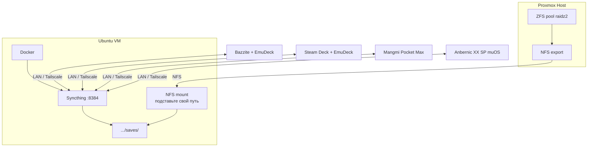

# Синхронизация сохранений эмуляторов (Syncthing)

Self-host хаб сохранений: **Syncthing в Docker** на Ubuntu VM (Proxmox), данные на **ZFS RAIDZ2** через NFS.

**Клиенты:** Bazzite + Steam Deck (EmuDeck), Mangmi Pocket Max (Android), Anbernic XX SP (muOS).

**Фаза 2 (позже):** Ludusavi — self-host «облако» для ПК-игр Bazzite ↔ Steam Deck.

---

## Архитектура



| Слой | Где |
|------|-----|
| RAIDZ2 + ZFS snapshots | Proxmox-хост |
| NFS-шара | Proxmox → Ubuntu VM (уже смонтирована) |
| Syncthing + Docker | Ubuntu VM |
| Syncthing **config** (Device ID, ключи) | **Локальный диск VM**, не NFS |
| Save-файлы | NFS → RAIDZ2 |

---

## Шаг 1. Каталоги на NFS

Подставьте свой mount path вместо `NFS_MOUNT` (узнать: `mount | grep nfs` или `/etc/fstab`).

```bash
NFS_MOUNT=/mnt/storage   # ← замените на реальный путь

sudo mkdir -p "$NFS_MOUNT/saves"/{emulation,pc-games}
sudo mkdir -p "$NFS_MOUNT/saves/emulation"/{retroarch-saves,retroarch-states,ppsspp-savedata}
sudo chown -R 1000:1000 "$NFS_MOUNT/saves"
```

Структура:

```
$NFS_MOUNT/saves/          # физически на Proxmox RAIDZ2
├── emulation/
│   ├── retroarch-saves/   # приоритет: .srm
│   ├── retroarch-states/  # опционально
│   └── ppsspp-savedata/
└── pc-games/              # фаза 2 — Ludusavi
```

### Proxmox: snapshots

На **хосте** (не в VM), для dataset, который бэкендит NFS:

```bash
zfs snapshot <pool>/<dataset>@$(date +%Y%m%d-%H%M)
```

Для NFS exports предпочтительно `sync` и UID/GID `1000:1000`.

---

## Шаг 2. Syncthing в Docker

Файлы в этом каталоге: [docker-compose.yml](docker-compose.yml).

```bash
# на Ubuntu VM
mkdir -p ~/docker/syncthing
cp docker-compose.yml ~/docker/syncthing/
# отредактируйте пути NFS в volumes
cd ~/docker/syncthing
mkdir -p config
docker compose up -d
```

Web UI: `http://<ubuntu-ip>:8384`

### Первичная настройка UI

1. **Settings → GUI** — логин/пароль
2. **Add Folder** для каждой подпапки:
   - Path внутри контейнера: `/data/emulation/retroarch-saves` и т.д.
   - File Versioning: **Simple**, 5–10 версий
3. Скопировать **Device ID** хаба — его вводят все клиенты

### Важно

- `./config` — на локальном диске VM. Бэкапьте: без него придётся перепаривать все устройства.
- GUI только в LAN или через Tailscale.
- Порты при `network_mode: host`: 8384, 22000/tcp+udp, 21027/udp.

---

## Шаг 3. RetroArch на всех устройствах

Одинаково на Bazzite, Steam Deck, Mangmi, muOS — **Settings → Saving**:

| Параметр | Значение |
|----------|----------|
| Sort Saves into Folders by Core Name | ON |
| Sort Save States into Folders by Core Name | ON |
| Sort Saves/States into Folders by Content Directory | OFF |
| Write Saves/States to Content Directory | OFF |
| Auto Save / Auto Load State | OFF |

Затем: Configuration File → Save Current Configuration.

**Правила:** одинаковые имена ROM; одно ядро на систему; приоритет — **in-game saves** (`.srm`); одно устройство за раз (save → выход → sync → другое устройство).

---

## Шаг 4. Bazzite и Steam Deck (EmuDeck)

EmuDeck кладёт `Emulation/saves/...` как **symlink**. Syncthing **не** синкает цели symlink — указывайте **Target**:

| Что | Target |
|-----|--------|
| RetroArch saves | `~/.var/app/org.libretro.RetroArch/config/retroarch/saves` |
| RetroArch states | `~/.var/app/org.libretro.RetroArch/config/retroarch/states` |
| PPSSPP SAVEDATA | `~/.var/app/org.ppsspp.PPSSPP/config/ppsspp/PSP/SAVEDATA` |
| Dolphin | `~/.var/app/org.DolphinEmu.dolphin-emu/data/dolphin-emu/...` |
| RPCS3 | `Emulation/storage/rpcs3/dev_hdd0/home/00000001/savedata` |

Документация: [EmuDeck Save Management](https://emudeck.github.io/save-management/steamos/save-management/), [community Syncthing](https://emudeck.github.io/community-creations/steamos/tools-and-guides/).

На клиентах — **нативный** Syncthing (`systemctl --user enable --now syncthing`), не Flatpak. Одна shared folder `retroarch-saves` на хабе обслуживает и Deck, и Bazzite.

---

## Шаг 5. Mangmi Pocket Max (Android)

- [Syncthing-Fork](https://github.com/Catfriend1/syncthing-android/releases)
- Web GUI: `http://<IP>:8384`
- RetroArch: `/storage/emulated/0/RetroArch/saves`
- PPSSPP: `PSP/SAVEDATA` в Memory Stick location
- Ограничить фоновый watch (батарея)
- `Android/data/` без root — недоступно Syncthing

---

## Шаг 6. Anbernic XX SP (muOS)

1. Configuration → Web Services → Syncthing → Enable
2. Web UI: `http://<IP>:7070` (порт **7070**)
3. Пути: `MUOS/save/file` и `MUOS/save/state` (или `/run/muos/storage/save/...`)
4. Те же Folder ID, что на Ubuntu hub
5. exFAT: отключить Watch for Changes
6. Опционально: [Syncthing-Tailscale](https://github.com/NolandTech/Syncthing-Tailscale)

---

## Шаг 7. Pairing клиентов с хабом

1. Ubuntu: Actions → Show ID
2. Клиент: Add Remote Device
3. Хаб: Sharing → отметить устройство
4. Клиент: принять папку, указать локальный путь
5. Folder Type: **Send & Receive**, Versioning: **Simple**

---

## Шаг 8. Вне дома (опционально)

Tailscale на Ubuntu, Bazzite, Deck, Android, muOS — Syncthing найдёт хаб без проброса портов.

---

## Фаза 2: ПК-игры (self-host вместо Steam Cloud)

| Компонент | Роль |
|-----------|------|
| [Ludusavi](https://github.com/mtkennerly/ludusavi) | Находит saves Steam/GOG/Epic/Proton (19k+ игр) |
| [Decky Ludusavi](https://github.com/GedasFX/decky-ludusavi) | UI в Game Mode на Deck |
| Syncthing | `$NFS_MOUNT/saves/pc-games` ↔ локальные бэкапы Ludusavi |

Паттерн: backup on quit → Syncthing → restore before launch. Steam Cloud пока не отключать.

---

## Что не синхронизировать

- Весь `Emulation/` и ROMs
- Symlink-папки `Emulation/saves/*` (только targets)
- `Android/data/` без root
- BIOS RetroArch

---

## Чеклист

- [ ] NFS смонтирован на Ubuntu; известен реальный путь
- [ ] `$NFS_MOUNT/saves/` создан, права `1000:1000`
- [ ] ZFS snapshot cron на **Proxmox**
- [ ] Syncthing Docker: config на локальном диске VM, saves на NFS
- [ ] GUI-пароль, versioning, бэкап `~/docker/syncthing/config`
- [ ] RetroArch Saving одинаков на 4 устройствах
- [ ] Bazzite + Deck: target-пути EmuDeck
- [ ] Тест: muOS → Ubuntu → Deck/Bazzite
- [ ] Тест PPSSPP Android ↔ EmuDeck
- [ ] (Фаза 2) Ludusavi + Decky + `pc-games/`

---

## Ссылки

- [Syncthing Docker README](https://github.com/syncthing/syncthing/blob/main/README-Docker.md)
- [muOS Syncthing](https://muos.dev/web/syncthing)
- [Retro Game Corps: Syncthing for handhelds](https://retrogamecorps.com/2024/08/11/guide-using-syncthing-with-retro-handhelds/)
